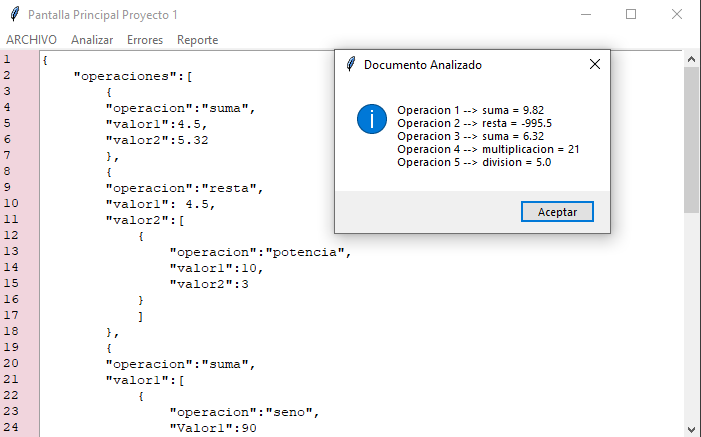

# Manual Técnico

___

## Lenguajes y librerias utilizados
Para la elaboración de este Proyecto se hizo uso del lenguaje Python con en el cual para poder realizar el desarrollo de la aplicación se utilizo de varias librerías tales como abc, math, os, sys, tkinter, entre otras más y así como algunas de sus dependencias como Filedialog, messagebox, checko_utput, ScrolledText, ttk entre otros, estas tienen diversas funciones que se explicaran más adelante

___

### Uso de librerias

* **abc**: Esta libreria proporciona la base para la creación de clases abstractas

* **math**: Este módulo proporciona acceso a las funciones matemáticas definidas en el estándar de C. Esta libreria se utilizo principalment al elaborar operaciones complejas como lo son las funciones trigonométricas ya que estas no se pueden determinar a través del teclado como lo son las funciones basicas (suma, resta, multiplicacion, division, etc.)

* **os**: Esta libreria fue utilizada para la creación de la grafica realizada durante la opcion de Reporte,en este modulo se utilizo os.environ y os.system.

* **sys**: Este módulo provee acceso a algunas variables usadas o mantenidas por el intérprete y a funciones que interactúan fuertemente con este mismo. 

* **tkinter**: tkinter es el motor de interfaz de usuario de python para la herramienta de Tcl/Tk, este fue utilizado para la elaboración de la interfaz de usuario para la facilitación de uso de la aplicación.Usado para crear una interfaz amistosa con el usuario igualmente para los siguientes funcionamientos:

    Empezamos con una funcion introducida por *filedialog.askopenfilename* para abrir un archivo seleccionado por el usuario. Para leer o escribir un archivo se utiliza la función *open()*. Para guardar un archivo como, osea con el nombre y direccion que escoga el usuario y no sobreleida se usa *filedialog.asksaveasfile*
    entre otras funciones para la interfaz con su submenu y su barra de herramientas.

* **subprocess**: Permite lanzar nuevos procesos, conectarse a sus pipes de entrada/salida/error y obtener sus códigos de resultado. Este módulo está destinado a reemplazar múltiples módulos y funciones previamente existentes.

___

## Interfaz y Analizador 

Para comenzar con la explicación de nuestra interfaz debemos de comprender que antes de crear una imagen a nuestro proyecto tenemos un algoritmo detras de ello a lo que se le llama un **ANALIZADOR**.

A este analizador es lo que nos ayuda a completar con nuestra interfaz ya que como dice analiza nuestra archivo de entrada y lo que incluye en este como lo son las operaciones. Pero antes debemos recorrer un poco más y irnos a nuestro Abstract donde utilizamos dicha libreria para crear nuestras clases.

* Abstract:
    
    * Clase Expression: en esta clase utilizamos la libreria ABC y definimos un init con lo más importante que son nuestras filas y columnas que nos ayudaran a leer toda nuestra entrada.

        Y aun más importante nuestos métodos abstractos con nombres, *operar*, *getFila*, *getColumna* 

        ~~~
        def __init__(self, fila, columna):
        self.fila = fila
        self.columna = columna

        @abstractmethod
        def operar(self, arbol):
        pass

        @abstractmethod
        def getFila(self):
        return self.fila
    
        @abstractmethod
        def getColumna(self):
        return self.columna
        ~~~
    
    * Clase Lexema: en esta clase leemos nuestro lexema osea nuestras palabras frases dentro del archivo de entrada. 

        ~~~
        def __init__(self, lexema, fila, columna):
        self.lexema = lexema
        super().__init__(fila, columna)
        ~~~

    * Clase Numero: en esta clase leemos nuestros números ingresados dentro del archivo de entrada. 

        ~~~
        def __init__(self, valor, fila, columna):
        self.valor = valor
        super().__init__(fila, columna)
        ~~~

* Instrucciones: 

    * Clase Aritmetica: en esta clase programamos todas aquellas operaciones basicas para nuestro archivo de entrada. 

    * Clase Trigonometrica: en esta clase programamos todas aquellas operaciones trigonometricas pedidas dentro de nuestro archivo de entrada, ademas que en dicha clase usamos la libreria math. 

    * Clase Texto: en esta clase programamos todas aquellas configuraciones que tendra nuestro archivo de entrada para el estilo de la grafica. 

* Errores: 

    * Clase Error: en esta clase podemos verificar los errores lexicos dentro de nuestro archivo de entrada. 

Ahora ingresaremos a la magia donde ocurre el uso de todas estas clases a traves de métodos, listas, globals, etc. Aqui importamos todas nuestras clases anteriormente creadas. 

Empezamos con un *reserved* donde estan todas nuestras palabras reservadas ya que lo que no tenga una palabra reservada se tomara como un error lexico.
    
    reserved = {
    'ROPERACIONES'      : 'Operaciones',
    'ROPERACION'        : 'Operacion',
    'RVALOR1'           : 'Valor1',
    'RVALOR2'           : 'Valor2',
    'RSUMA'             : 'Suma',
    'RRESTA'            : 'Resta',
    'RMULTIPLICACION'   : 'Multiplicacion',
    'RDIVISION'         : 'Division',
    'RPOTENCIA'         : 'Potencia',
    'RRAIZ'             : 'Raiz',
    'RINVERSO'          : 'Inverso',
    'RSENO'             : 'Seno',
    'RCOSENO'           : 'Coseno',
    'RTANGENTE'         : 'Tangente',
    'RMOD'              : 'Mod',
    'RCONFIGURACIONES'  : 'Configuraciones',
    'RTEXTO'            : 'Texto',
    'RFONDO'            : 'Fondo',
    'RFUENTE'           : 'Fuente',
    'RFORMA'            : 'Forma',
    'COMA'              : ',',
    'PUNTO'             : '.',
    'DOSPUNTOS'         : ':',
    'CORI'              : '[',
    'CORD'              : ']',
    'LLAVEI'            : '{',
    'LLAVED'            : '}',
    }

A continuación veremos un resumen de las clases más importantes que hay dentro de **Analizador.py**

* **instruccion(cadena)**: aqui creamos un método que tiene una instancia cadena, esta instancia ocuparemos para validar cada movimiento o caracter que tenga nuestro archivo de entrada.

* **armar_lexema(cadena)**: en este método es como dice armamos nuestro lexema osea cada letra.

* **armar_numero(cadena)**: en este método es como dice armamos nuestros números tanto los decimales como enteros.

* **operar**: es el método más importante ya que es donde nosotros operamos todas las operaciones y configuraciones que trae nuestro archivo de entrada. Aqui validamos y hacemos el análisis para cada operación y configuración de las anteriormente mencionadas e igualmente veremos que dentro de este método analizamos los errores lexicos dentro del archivo analizado ya que dentro del codigo verificamos todos aquellos lexemas y numeros aceptamos sino es un error lexico.

    ~~~
    else:
        lista_errores.append(Error(char, n_linea, n_columna))
        cadena = cadena[1:]
        puntero = 0
        n_columna += 1
    ~~~

* **operar_recursivo**: es el método donde utilizamos el objetivo de tal proyecto la *recursividad* para ello utilizamos el método operar por ello era el método más importante. 
    
    ~~~
    global instrucciones
    while True:
        operacion = operar()
        if operacion:
            instrucciones.append(operacion)
        else:
            break
    ~~~

* **ObtenerErrores**: este método aparte de ser demasiado pequeño es muy importante ya que en este retornamos los errores lexicos.

Para finalizar pasaremos a donde el usuario interactua con el programa así es la **INTERFAZ**.

Es importante conocer los métodos utilizados, *abrirArchivo*, *Guardar*, *GuardarComo*, *actualizar_linea*, *analizar*, *grafica*, estos son todos los métodos utilizados durante la interfaz, cabe resaltar que para algunos de ellos se tuvieron que importar métodos del analizador. Aqui daremos nuestra atención a nuestro init ya que aqui es donde nosotros le dimos un diseño a nuestra interfaz la cual veremos a continuación. Ahora nuestros métodos son para cada una de las opciones de la interfaz.

A continuación veremos un resumen de las clases más importantes que hay dentro de **Analizador.py**

* **abrirArchivo**: en este método es utilizado para seleccionar nuestro archivo, ya que este abre una ventana de dialogo y al momento de ser seleccionado se podra visualizar en nuestro cuadro donde se podra editar si es que el usuario así lo desea. Despues de seleccionar nuestro archivo esta ventana se cerrara y mostrara en nuestra interfaz dicho archivo de entrada, cabe resaltar que al momento de buscar un fichero solo mostrara con extensión .json.

* **actualizar_linea**: actualizara cada linea ingresada dentro de nuestro archivo de entrada o durante la edición del mismo.   

* **analizar**: este método analiza nuestro archivo de entrada en el momento que el usuario este seguro de los cambios hechos podra analizar para conocer los resultados mostrados en un cuadro de dialogo. 

* **grafica**: aqui inicia nuestro algoritmo para crear el reporte que es una grafica y un documento .dot, en este método nos ayudamos de otro el cual pasaremos a un string para que todo aquel numero no tenga problemas durante la ejecucion. 

    ~~~
    operar_recursivo().clear()
    instrucciones = instruccion(self.data)
    respuestaO = operar_recursivo()
    
    graf_contenido = "digraph G {\n\n"
    abrir = open("Operaciones.dot", "w", encoding="utf-8")
    graf_contenido += str(Graphviz(respuestaO))
    graf_contenido += '\n}'
    abrir.write(graf_contenido)
    abrir.close()

    os.environ["PATH"] += os.pathsep + 'C:\Program Files\Graphviz\bin'
    os.system('dot -Tpng Operaciones.dot -o Operaciones.png')
    ~~~

    

* **Errores**: este método nos mostrara en un archivo .txt los errores lexicos dentro del archivo de entrada, es muy importante reconocer que dentro de este escribimos el archivo de salida al recorrer una lista igualmente cuando termina mostrara una ventana al usuario con el mensaje de la cantidad de errores lexicos. 

    

* **Graphviz**: este metodo es donde ocupamos todas aquellas configuraciones que el usuario ingreso a detalle como lo son:
    * Texto: es el titulo de nuestra grafica
    * Fondo: es el color de fondo para la forma escogida
    * Fuente: es el color de fuente
    * Forma: es la forma del objeto donde mostraran los resultados

Luego crearemos una variable texto la cual es la responsable de darle una *a* a nuestra grafica ya que sin ello no se comprenderia. Haremos usos de los nodos para crear una grafica para el usuario donde utilizamos los un ciclo para recorrer cada valor ingresado por el usuario como cada resultado. Cada valor, respuesta y total tiene su poprio nodo igual que debemos de saber la **O** de Graphviz. 

~~~
    text += "\tnodoRespuesta{Columrespuesta}"
    text += "\tnodoIzqu{ColumnumIzq}"
    text += "\tnodoDere{ColumnumDer}"
    text += "\tnodoT{ColumTotal}" 
~~~

