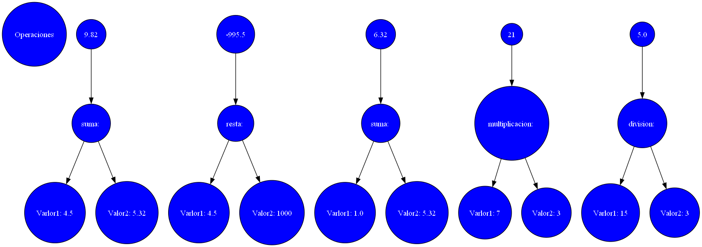

# Manual de Usuario

___

## Interfaz de Inicio

La interfaz de inicio mostrada en la siguiente imagen. En ella podemos observar una barra de opciones las cuales tienen las diferentes funciones.

Función **ARCHIVO**: esta opción despliega un submenú con las siguientes opciones. "Abrir", "Guardar", "Guardar Como", "Salir". Estas opciones tienen las siguientes funciones:

*Abrir*: esta opción abre una ventana donde debemos de seleccionar un archivo con extensión .txt donde en la interfaz podemos editar algun valor o operacion.

*Guardar*: esta opción debera guardar el archivo que esta en la interfaz.

*Guardar Como*: esta opción abre una ventana para guardar el archivo que esta en la interfaz con el en la dirección donde deseemos y nombre escogido.

*Salir*: esta opción saldra de la interfaz.

Función **ANALIZAR**: esta opción analiza las operaciones que contiene nuestro archivo seleccionado o nuestro archivo editado, aparecera una ventana con los resultados obtenidos.

Función **ERRORES**: esta opción muestra un archivo de texto en el cual saldran los errores lexicos que se encuentran en nuestra entrada.

Función **REPORTE**: esta opción generara una grafica en una imagen del documento analizado en esta imagen podremos visualizar de una mejor manera los resultados de nuestras operaciones ingresadas con la configuracion del color, forma, fuente con nuestro titulo.

